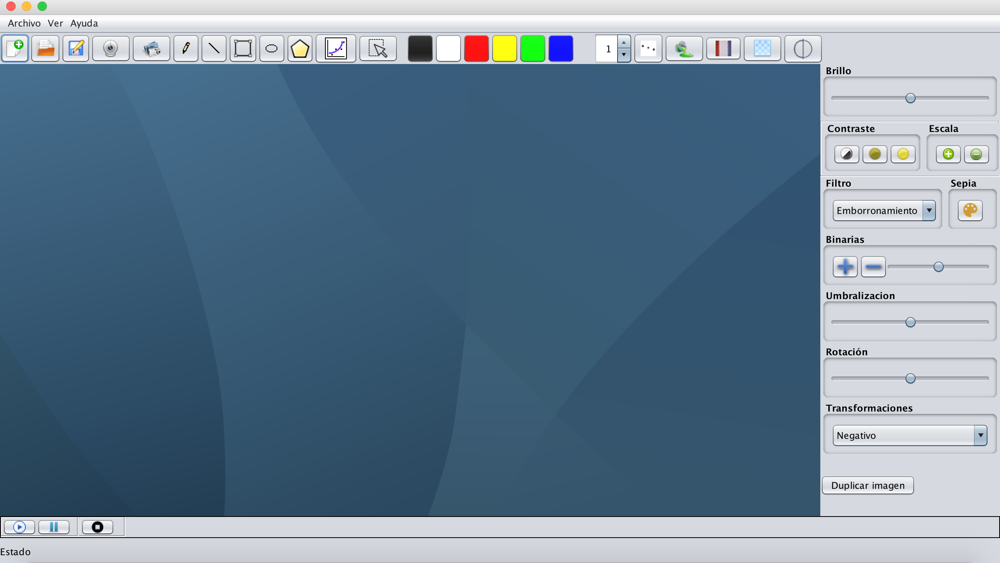

# SistemasMultimedia

Programa creado para la asignatura Sistemas multimedia. El programa ha sido escrito en Java y usado el IDE NetBeans.

Con este programa se puede abrir imágenes y realizar una serie de operaciones sobre ella. También podemos dibujar figuras y darles forma. Otra de las funcionalidades es poder escuchar música o grabar audio.

Tiene implementado la captura de cámara pero en ordenadores Mac no funciona, en ordenadores Windows o Linux si (hace falta descargar la librería correspondiente de java para que se pueda ejecutar).

El entorno gráfico tiene el siguiente aspecto:

